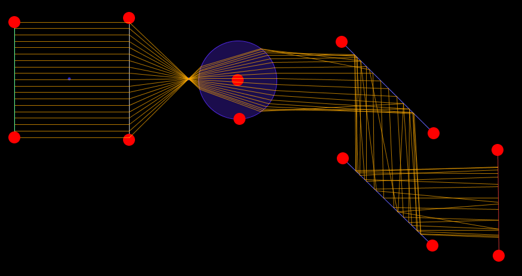
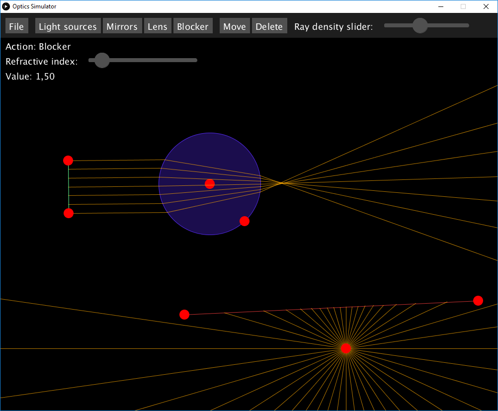

# Optics Simulator
## Brief description
This is a GUI application where the user enters a system consisting of lenses, mirrors and light sources and the program calculates and shows how each ray goes through the system.

Program supports ideal and circle lens, flat and ideal curved mirror and a light blocker.

As a light source, you can use a single ray, a beam of parallel rays or a point source, which shoots rays in all directions.
 

## User guide
### Running the program
1. Download the program from releases and unzip it.
2. Make sure you have `Java` installed
3. Start the program by either double clicking on `OpticsSimulator-1.0-SNAPSHOT.jar` or calling `java -jar OpticsSimulator-1.0-SNAPSHOT.jar` if using CLI.

### Controlling the program
#### Dropdowns
You open a dropdown by hovering your mouse over it. After that, you choose the requested action by moving your mouse to the relevant button and pressing the left mouse button. 

#### Buttons
You press a button by hovering your mouse over it and pressing the left mouse button.

#### Sliders
You move a slider by:
* Either hovering over the "slider button", pressing the left mouse button, moving the "slider button" to requested position and releasing the left mouse button.
* Or hovering over the position you want the slider to be at and pressing the left mouse button.

#### GUI design
All of the UI elements are located at the top of the screen. There are four dropdowns (`File`, `Light Sources`, `Mirrors` and `Lens`), three buttons (`Blocker`, `Move` and `Delete`) and one or two sliders (`Ray density slider` and `Refractive index` or `Focus distance` slider).

Each of the dropdowns contains several buttons:
* `File` - `Reset` button (remove everything that has been created, resets zoom and screen position and sets action to `Move`)
* `Light sources` - `Ray`, `Beam` and `Point source` (set `Action` to creating `Ray`/`Beam`/`Point source`)
* `Mirrors` - `Flat` and `Ideal curved` (set `Action` to creating a `Flat`/`Ideal curved` mirror)
* `Lens` - `Circle` and `Ideal` (set `Action` to creating a `Circle`/`Ideal` lens)

Buttons:
* `Blocker` - sets `Action` to creating a `Blocker` (used to block light rays)
* `Move` - sets `Action` to `Move` (used to move the view)
* `Delete` - sets `Action` to `Delete` (used to delete specific objects)

Sliders:
* `Ray density slider` - controls the density of rays coming out from `Beam` and `Point source` light sources. Moving to the right increases density.
* `Refractive index`/`Focus distance` slider - control the refractive index or focus distance of the active object (will be shown only if the active object has these settings)

#### Actions:
Current action is shown in the label right under `File` dropdown (`Action: <current-action>`).

For all of the following actions aside from `Delete`, you need to hover your mouse in some free space (not on UI or the red circles).
* `Ray`, `Beam`, `Flat`, `Ideal curved`, `Circle`, `Ideal`, `Blocker`: location of these objects is specified by two points - to create this object, hover your mouse over the place on screen where you want the first point to be, then press the left mouse button and drag you mouse to the second location where you release it.
* `Point source`: location of point source is specified by one point only - to create the point source, hover your mouse over the place on screen where you want it to be and press the left mouse button.
* `Move`: move the view by pressing the left mouse button, moving your mouse and releasing.
* `Delete`: delete some object by hovering your mouse over one of its red circles and pressing the left mouse button.

#### Other controls:
You can use both of the following controls in any `Action` state aside from `Delete`.
* Moving the objects: move a point of a certain object by hovering your mouse over one of its red circles, pressing the left mouse button, moving it to a new location and releasing the left mouse button.
* Changing refractive index/focus distance of an object: select an object by clicking on one of its points (red circles). If the object has additional settings (refractive index or focus distance), new slider will be created for these settings (as shown on picture below). You can set the new value using the slider. The current value is shown under the slider with a label `Value:`

There is also `zoom` - hover your mouse over the location on the screen where you want to zoom and use mouse wheel to zoom in or out.

#### Example state
Image is showing a state, with `Beam` and `Point source` as lights sources. Rays from the `Beam` go through a `Circle` (which is also an active object as you can see from the `Refractive index` slider). Rays from the `Point source` are partially blocked by a `Blocker`. Current action is to create a `Blocker`.

### Notes & Warnings
Program (`OpticsSimulator-1.0-SNAPSHOT.jar`) requires a [Processing 3](https://processing.org/download/) library to be provided in path `lib/core-3.3.7.jar` relative to the program as this path is hardcoded in the `.jar` manifest. A copy of this library is provided.

Two Circle glass objects should not overlap, otherwise the resulting simulation won't be correct!

## Resources & Other info
* [Processing 3](https://processing.org/download/) - the graphical library used in this project
* [line-line intersection](https://en.wikipedia.org/wiki/Line%E2%80%93line_intersection)
* [line-circle intersection](http://mathworld.wolfram.com/Circle-LineIntersection.html)
* [ideal lens equation](https://www.sciencedirect.com/science/article/pii/S0030402615000364#eq0005)
* [Snell's law](https://en.wikipedia.org/wiki/Snell%27s_law)

Toto je zápočtový program vytvořený Jakubem Medkem během letního semestru 2018/19 I. ročníku IOI MFF UK pro předmět Programování II (NPRG031).